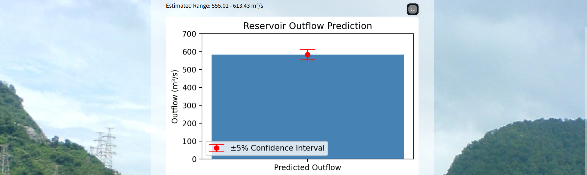
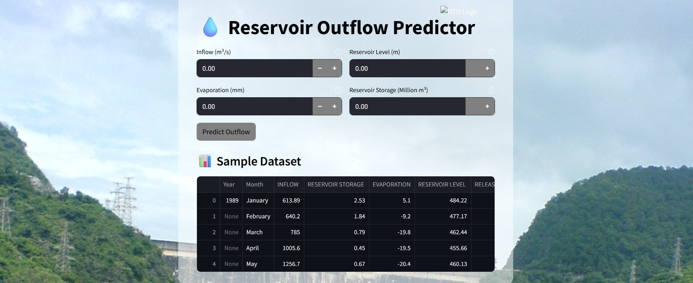

# 💧 Reservoir Outflow Predictor using Machine Learning

📘 **Final Year B.Tech Project – Delhi Technological University (DTU)**  
📅 **Duration:** August 2024 – May 2025  
👤 **Author:** Himanshu ([GitHub](https://github.com/Himanshu-1402) | 🔗 [LinkedIn](https://www.linkedin.com/in/himanshu-saroha-07783122b)


---

## 📌 Project Overview

This project uses **machine learning** to predict **daily reservoir outflow** based on hydrological parameters such as inflow, evaporation, reservoir level, and storage.  
It integrates both **analytical modeling** and a **Streamlit-based web app** to visualize and interact with predictions in real time.

---





## 🔍 Key Features

- ✅ Real-time outflow prediction using a trained **Random Forest** regression model  
- 📊 ±5% confidence interval estimation  
- 🧮 Multiple modeling approaches: **Monte Carlo**, **Group Method**, **Backpropagation**, **Random Forest**  
- 🎯 Clean and interactive **Streamlit dashboard** with DTU branding  
- 🧾 Data preview and visualizations  
- 📁 Easy-to-use modular project structure  

---

## 🛠 Tech Stack

- **Language**: Python  
- **Libraries**: Pandas, Scikit-learn, Matplotlib, Streamlit, NumPy  
- **Deployment**: Streamlit Web App  
- **Data Tools**: Excel, CSV  
- **Model**: Random Forest (joblib)

---

## 📂 Project Structure

Reservoir-Outflow-Predictor/ <br>
├── dashboard.py # Basic Streamlit app <br>
├── dashboardupdated.py # Enhanced dashboard with charts & DTU branding <br>
├── backpropagation.ipynb # Notebook implementing backpropagation <br>
├── montecarlo.ipynb # Monte Carlo simulation for outflow <br>
├── groupmethod.ipynb # GMDH-based prediction <br>
├── optimized.ipynb # Tuned ML model evaluation <br>
├── notebook.ipynb # General EDA and modeling <br>
├── Dataset.csv / dataset.xlsx # Input hydrological dataset <br>
├── OutputData.xlsx # Sample output predictions <br>
├── random_forest_model.pkl # Trained Random Forest model <br>
├── requirements.txt # Python dependencies (recommended) <br>
├── README.md # Project documentation <br>
└── .gitignore # Ignore unneeded files (e.g., .pyc, checkpoints)


---

## 🚀 How to Run Locally

```bash
# Step 1: Clone the repository
git clone https://github.com/Himanshu-1402/Reservoir-Outflow-Predictor.git
cd Reservoir-Outflow-Predictor

# Step 2: Install required packages
pip install -r requirements.txt

# Step 3: Run the Streamlit dashboard
streamlit run dashboardupdated.py
